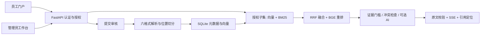

# 知序 · 企业知识门户

让文档、经验与问答回到同一个工作空间。

**[在线体验](https://lhui278674-ux.github.io/zhixu-knowledge/) · [演示资料与体验路线](docs/DEMO_CORPUS.md) · [架构设计](docs/DESIGN.md) · [本地运行](docs/RUNNING.md)**

当前仓库尚未启用 GitHub Pages，在线入口的本次部署未完成；源码和本地完整版本已更新。具体构建与部署结果见 [验收说明](docs/ACCEPTANCE.md)。

知序是可独立部署的中文企业知识库系统：员工查阅资料、检索和提问，管理员管理文库、成员和审核。React + TypeScript 前端，FastAPI + SQLite 后端，本地 BGE 混合检索；原文引用可追溯到页、段落、表格行、单元格或幻灯片。虚构公司资料是可选演示包，真实部署从空知识库开始。

长期实施目标和当前进度见 [PROJECT_GOAL.md](PROJECT_GOAL.md)、[ROADMAP.md](ROADMAP.md)、[CURRENT_TASK.md](CURRENT_TASK.md)。目前交付固定领域限制的首个可运行阶段；管理员模型配置、完整工具型 Agent 和云部署仍在路线中。

## 先体验

在线版无需安装、注册或输入密码。选择「员工」「管理员」或「复核管理员」即可操作。

- 员工：文库与目录、标题/正文搜索、格式筛选、收藏、最近查看、证据摘录与原文预览。
- 管理员：文库和目录维护、员工注册审核、成员授权、资料审核、管理员身份变更复核、操作记录。
- 上传演示：支持 TXT / MD，待审资料不会进入搜索；审批后可搜索并定位到原文。所有操作仅保存在当前浏览器，可重置。

在线版是 **GitHub Pages 静态交互演示**：使用浏览器原文检索与证据摘录，不调用生成模型，不连接本机数据库、账号或密钥。全部虚构文件在公开仓库中，角色切换用于展示工作流程，不能作为服务器访问控制的证明。完整版本的认证、权限校验、本地向量检索、六格式导入和 AI 生成见下文。

## 项目能力

| 员工知识门户 | 管理员工作台 |
| --- | --- |
| 可折叠导航、常用文库、目录树 | 独立导航与管理布局 |
| 标题和正文搜索、格式与目录筛选 | 文库、目录、文档与成员授权 |
| 个人收藏、最近查看 | 员工注册申请、资料入库审核 |
| AI 有据问答、证据摘录、个人历史 | 两位管理员分工与身份变更复核 |
| 点击引用查看原文位置 | 操作记录、服务与限额状态 |

完整后端在浏览、搜索、下载、问答和引用阶段检查当前文库授权。成员权限区分查看和资料提交；提交资料经过审批后才解析、入索引。管理员日常维护可直接进行；身份、启停和职责变化必须由另一位指定管理员复核。

PDF、DOCX、XLSX、PPTX、TXT、MD 六种格式均有实际解析器。不包含在线协同编辑、外链分享、模板编辑、评论和自动 OCR。

## 接近真实工作的虚构知识库

虚构公司「星桥科技」约 120 人，包含员工手册、公司协作、财务采购、IT 运维、客户交付、项目产品和研发规划 **7 个文库、20 个目录、32 份文件**。资料包括流程、负责人、版本、业务案例、预算和服务台账，解析后约 3.9 万字符、588 个原文片段（含切分重叠及表头）。

资料之间关联星舟知识项目、青禾客户交付和桥云服务台。同一问题的 400 / 500 元住宿标准冲突保留为演示案例。公司、客户、人员、联系方式、金额及业务记录均为虚构；联系地址使用 `example.com`。

[查看目录与推荐问题](docs/DEMO_CORPUS.md)。源文件位于 `demo/`；`scripts/demo_corpus.py` 为原创内容，`scripts/create_demo.py` 生成六格式原件，`scripts/export_public_demo.py` 使用同一解析器导出静态演示。

## 技术实现



- **前端**：React 19、TypeScript、Vite、Lucide；中文界面、桌面与窄屏布局、弹窗焦点管理。
- **后端**：FastAPI、SQLite WAL、原始文件与待审区；增量数据迁移，保留既有账号、文档、向量和问答。
- **检索**：BGE small zh v1.5、BM25、RRF、BGE reranker base；持久化片段、位置和向量。
- **问答**：可选 OpenAI 兼容生成服务，逐项校验 source ID 与连续原文；持久化 SSE、限流、取消和故障反馈。
- **领域限制**：后端固定政策，越界返回「超出服务范围」及空引用；未知业务事项先澄清。输入、来源、最终摘录、历史及 SSE 重放均有门禁，默认问答不检索演示文库。当前采用保守任务分类与原文输出校验，完整语义 Agent 尚待实现。
- **验证**：真实解析、本地模型和隔离数据库的集成测试；外部模型响应在自动化中模拟。测试范围与服务边界见 [验收说明](docs/ACCEPTANCE.md)。

## 本地运行完整版本

需要 Python 3.12+、Node.js 20+；CPU 可运行，初次模型下载约 1.15 GiB。

```powershell
git clone https://github.com/lhui278674-ux/zhixu-knowledge.git
cd zhixu-knowledge
.\setup.ps1
.\start.ps1
```

打开 `http://127.0.0.1:8000`。首次创建两个独立管理员，没有默认生产账号。管理员建立企业文库、上传自己的资料，再创建或审核员工并授权文库。未配置生成密钥时仍可使用本地证据摘录。需要演示时主动导入虚构资料，在问答范围中明确选择演示文库；默认「企业文库（不含演示）」不会混入演示答案。

[详细运行、密钥配置、备份和升级说明](docs/RUNNING.md)。模型权重、环境、数据库、原始用户文件、日志、密钥和私人验收产物不随仓库发布。

仅运行公开演示：

```sh
cd frontend
npm ci
npm run build:demo
npx vite preview --host 127.0.0.1
```

## 验证

```powershell
.\.venv\Scripts\python.exe -m pytest tests -q
cd frontend
node --test tests/public-demo.test.mjs
npm run build
npm run build:demo
```

完整集成测试需要先下载两个本地模型。GitHub Actions 检查两种前端构建和公开交互流程，并发布在线演示；不配置或上传生成服务密钥。

## 参考与许可

信息架构参考 [JVS 知识库](https://github.com/RKQF-JVS/jvs-knowledge-ui)的业务前台、管理后台、文库、目录和预览结构；知序的代码、虚构内容和品牌界面独立实现，未复制其代码或素材。依赖与模型的来源见 [设计文档](docs/DESIGN.md)。

项目代码及原创虚构演示资料采用 [MIT License](LICENSE)。本机版本定位为可运行的作品与小型知识库，尚未覆盖多租户、高可用或大规模生产运维。
