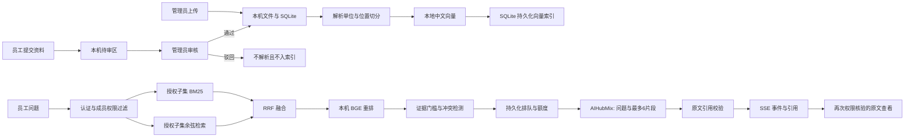

# 知序设计与依据

## 参考边界

2026-09-27 UI 改造参考 [JVS 知识库项目](https://github.com/RKQF-JVS/jvs-knowledge-ui)及其 [功能说明](https://raw.githubusercontent.com/RKQF-JVS/jvs-knowledge-ui/master/README.md)的业务前台/管理后台、文库、目录、搜索、预览与收藏结构。界面和实现均在知序现有项目中重构，没有复制参考项目的代码或素材。保留知序的中文品牌、浅绿员工门户与深绿管理导航。不引入在线协同编辑、外链分享、模板编辑或评论。

模型和接口事实以一手文档核对：

- [AIHubMix 模型页](https://aihubmix.com/model/coding-kimi-k3-free)：2026-09-26 页面标注 5 RPM、100 RPD、100 万 token/日；OpenAI 兼容 base URL 为 `https://aihubmix.com/v1`。
- [BGE 中文 small 模型卡](https://huggingface.co/BAAI/bge-small-zh-v1.5)：中文 embedding 与查询前缀；MIT 许可。
- [BGE 重排模型卡](https://huggingface.co/BAAI/bge-reranker-base)：本地 cross-encoder 重排；MIT 许可。

权重下载时固定仓库 revision，并在 `models/manifest.json` 记录各文件 SHA-256。验证时 embedding revision 为 `7999e1d3359715c523056ef9478215996d62a620`，reranker revision 为 `2cfc18c9415c912f9d8155881c133215df768a70`。只加载 safetensors 与本地配置，不启用远程代码。

## 数据流

源文本切分最大 500 字、步长 420，在单一定位单位内重叠，不跨 PDF 页、幻灯片、段落或工作表行。XLSX 每行附表头，并同时标注表头位置。向量签名包括模型 revision，避免混用模型向量。

召回向量和关键词各 top-20，经 RRF(k=60) 融合，取 16 个候选在本机重排，最终最多 6 个片段。初始证据阈值为 sigmoid score 0.15，这是待真实数据集校准的工程参数，不是概率或准确率承诺。

## 权限与版本

员工自助注册为 pending；只有 approved 且 active 的账号可以登录或恢复会话。员工账号无法进入管理员入口或调用管理接口；管理员可以进入员工门户。旧账号增量迁移默认 approved，原账号、密码摘要及已有记录保留。

成员关系有 view/submit 两级，submit 包含查看和提问。标题和正文搜索、目录、收藏、最近查看及提交列表在服务端按当前文库权限筛选，个人收藏和阅读记录按 user_id 隔离。搜索通过 SQLite 对标题与已解析 chunk 内容进行大小写不敏感的连续字符串匹配，支持标题/正文/两者、格式、文库和目录子树筛选；不是新的语义搜索服务。问答仍使用原混合召回。

员工提交只创建 submissions 记录和原文件；审核前不创建 documents/chunks，也不调用解析、embedding 或问答任务。审核通过时在事务内重新核验提交人当前账号状态、submit 权限及重复文件，再创建待处理文档；事务提交后进入原解析队列。服务重启恢复排队文档。驳回、重复审核和审批前撤销提交权限不会污染索引。管理员直接上传继续走原处理链路。

目录只能隶属一个文库，父目录必须同库且不得形成循环。删除目录及子目录时，保留文件并归根目录；删除文库会级联移除目录、文档及提交记录。目录位置是元数据，移动目录不改变引用 chunk ID 或文档版本。

首次设置用单一事务创建两位独立管理员并分别绑定申请、复核职责。已有单管理员登录后补设第二位并选择职责，此流程仅能执行一次。已有多管理员迁移按创建顺序绑定前两位。两位都能直接处理普通知识管理；只有申请职责账户能提出管理员晋升、降级、停用、恢复或职责转交；只有指定复核职责账户能批准/驳回，不能自审。职责占用者不能直接降级或停用，必须先复核转交职责。每次审批校验申请时的角色、启停与职责快照，防止陈旧申请覆盖新状态；批准身份变更后使目标旧会话失效。注册、资料审核、管理员变更与日常维护均记录审计。

管理员可访问所有知识库；员工只通过 members 关系访问。检索 SQL 在向量计算和 BM25 建模前筛选库；原文、文件下载、SSE、历史回答均再次验证授权。猜测文档 ID 或传入未授权库不会获得资料。外部发送与成员撤销/账号停用操作通过进程锁串行，发送前再次校验证据版本，避免排队期间撤权后仍发送旧片段。

文档版本变更及删除先移除旧 chunks，索引任务提交时确认同一版本仍存在。引用包含 chunk ID 与 version，旧版本不能被当作当前出处。历史记录中的失效或无权限回答被隐藏；已经在用户屏幕上看过的内容无法从人的记忆中撤回。

## 生成与拒答

模型只产生证据选择 JSON，用户与片段为独立 user 数据对象，系统规则要求不服从文档中的指令。输出 source ID 必须来自此次授权检索，quote 必须是该片段逐字连续内容。后端拒绝虚构、变更或无法定位的引用；UI 不渲染任意 HTML。

模糊的短问题先追问；没有高于门槛的片段则拒答；相同字段的数字规定冲突先保守并列，再由制度负责人确认优先级。其他语义冲突由生成模型选择 conflict；仅靠原文校验不能证明任意语义的完全正确性，需要实际问题集、人审和 bad-case 回归。复杂公式、OCR、图片、嵌入对象和不受支持的 Office 内容不会自动获得解释能力。

SSE 事件持久化，支持 Last-Event-ID 重放。提交接口先保存问题，服务端队列独立于浏览器连接；断线不会丢失问题。模型原始流先缓冲以完成引用校验，客户端收到的是校验后的流式片段，不显示未经校验的 token。

## API 分组

| 分组 | 核心接口 |
| --- | --- |
| 认证 | `GET /api/auth/status`、`POST /api/auth/setup`、`POST /api/auth/login`、`POST /api/auth/logout`、`GET /api/auth/me` |
| 注册审核 | `POST /api/auth/register`、`GET /api/registrations`、`POST /api/registrations/{id}/review` |
| 管理员治理 | `GET /api/governance`、`POST /api/auth/complete-setup`、`GET/POST /api/admin-changes`、`POST /api/admin-changes/{id}/review` |
| 用户 | `GET/POST /api/users`、`PATCH /api/users/{id}` |
| 知识库 | `GET/POST /api/libraries`、`PATCH/DELETE /api/libraries/{id}` |
| 目录 | `GET/POST /api/libraries/{id}/directories`、`PATCH/DELETE /api/directories/{id}` |
| 文档中心 | `GET /api/portal/documents`、`GET /api/documents/search`、`PATCH /api/documents/{id}`、`PUT/DELETE /api/favorites/{id}` |
| 资料提交 | `GET /api/submissions`、`POST /api/libraries/{id}/submissions`、`GET /api/submissions/{id}/file`、`POST /api/submissions/{id}/review` |
| 文档 | `GET/POST /api/libraries/{id}/documents`、`DELETE /api/documents/{id}`、`POST .../reindex`、`GET .../source`、`GET .../file` |
| 成员 | `GET /api/libraries/{id}/members`、`PUT/DELETE .../members/{user_id}` |
| 问答 | `POST /api/qa/search`、`POST/GET /api/qa/questions`、`GET .../{id}`、`GET .../{id}/events`、`POST .../{id}/cancel` |
| 运行状态 | `GET /api/system`、`GET /api/audit`（管理员）、`POST /api/demo`（管理员） |

本机单实例、环回监听与本机用户权限是运维边界。服务可检查密钥是否存在，不会把“已配置”当作外部模型已验证可用；真实返回失败时给出相应状态。

## 数据升级与界面约定

schema_version=2：users 增加 review_status/review_note；members 增加 permission（旧成员默认 view）；documents 增加可空 directory_id；新增 directories、favorites、recent_views、submissions、admin_changes，职责保存在 settings。迁移按 PRAGMA table_info 判断缺失字段，建表/字段可重复执行，不替换旧表、不重建旧向量。发布前比较原数据库原列和完整旧行，测试还用包含旧文档、片段、向量及问答的合成单管理员数据库验证迁移与补设。

员工导航：知识门户、全部文档、收藏、最近查看、问答、个人历史、我的提交。管理导航：总览、文库、注册、资料审核、授权、成员、管理员变更、操作记录及服务状态。窄屏使用抽屉导航，文档表格在自身容器滚动，原文保留引用定位和 PDF 页链接。界面只展示字段、操作反馈、空状态及故障状态；权限政策、职责约束、模型和数据流解释留在 README/本设计文档中。

## 公开演示部署

GitHub Pages 仅发布静态前端、原创虚构原件及同一解析器导出的 JSON。构建模式 `public-demo` 选择浏览器状态适配器和 hash 路由；本地默认构建继续访问 FastAPI。静态演示的资料、角色和状态均不是生产认证或服务端授权，公开原件包含虚构研发库。访客操作保存在独立 localStorage 键，可重置；没有生成模型请求或私人账号、密钥和本地数据连接。TXT/MD 审核通过后在浏览器内创建可检索片段，其余格式原件可下载，本地完整版本提供实际六格式上传解析。

完整后端的证据模式在重排阈值之外核对问题明确提出的年份和项目编号，缺少对应原文时拒绝将通用段落当作证据。该保守检查不能代替真实语料上的相关性、语义忠实度和拒答评估。
